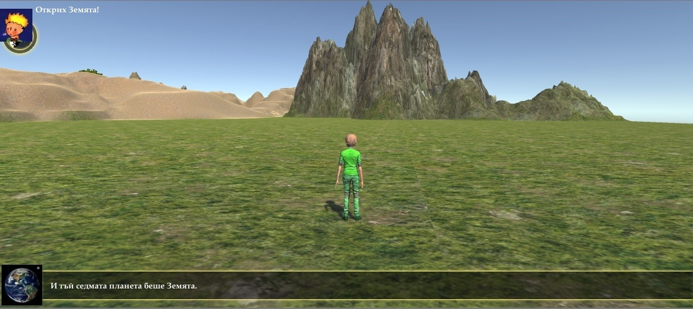
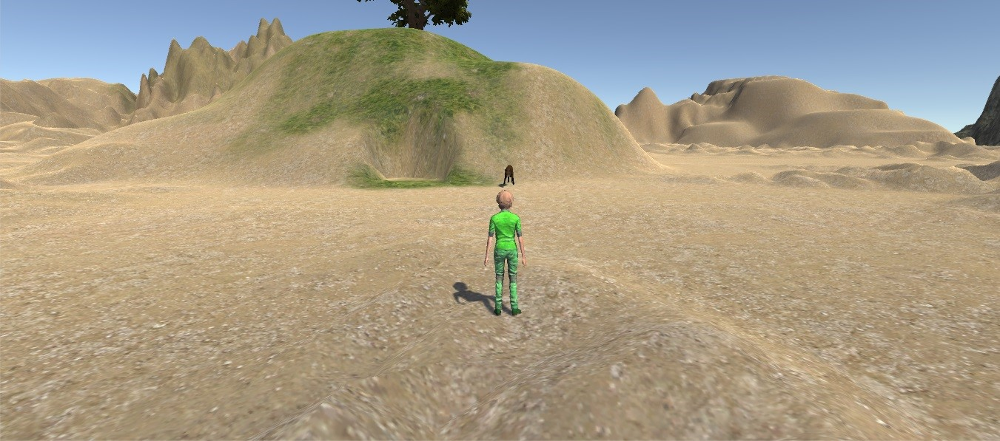
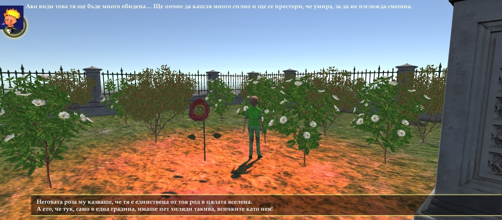
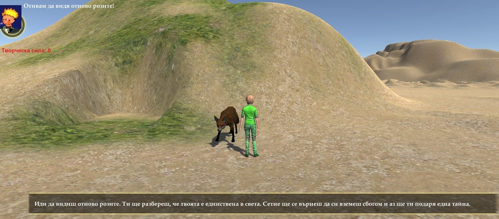

# TheLittlePrince
The little prince educational game

Задачи в играта
Сцени от „Малкият принц“ включени в играта:
1.	Малкият принц пристига на Земята
2.	Среща със змията
3.	Среща с цветчето
4.	Разговор с ехото
5.	Градината с рози
6.	Опитомяването на лисицата

Сцени от играта
1.	Терен за реалистично представане на историята от сцени от „Малкият принц“. Разработен е пустинен терен с планини и градина с рози от докторанта.

2. Модел на аватара.

 
3.	Модел с текстури на розата от произведението.

 
4.	Модел с текстури на лисицата.

 

